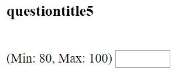
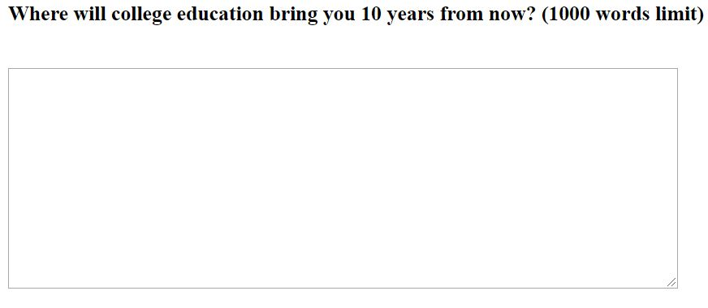
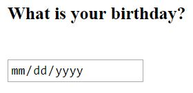
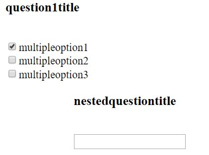

# COS382_Survey_Generator
**SurveyGenerator** is an ANTLR-written, Domain Specific Language(DSL) designed for creating surveys. In this project, we implemented a simple and easy-to-learn language that parses a survey description (.txt) and generate a survey file in HTML format.
Various question formats are supported, including:

- Multiple choice question
    - Single-answer (radio buttons)
    - Multiple-answers (checkboxes)
- Text
- Number
- Dates
- File upload
- Likert (5-point) scale

Also, this language supports "nested" questions, which are questions that only appear if certain answers were chosen.

Syntax
================

Below is the description of our question-creating commands syntax, each followed by appropriate examples.

-----
 
<big>To get started</big>

*Survey title* should be specified at the first line of the file, followed by '!'.

Following the format:

~~~~~~~~~~~~~~~~~~~~~~~~~~~~~~~~~~~
!"title_of_survey"
~"optional_page_title"
~~~~~~~~~~~~~~~~~~~~~~~~~~~~~~~~~~~

'~' handles *page title*(for each page in survey), which is optional.

Then you can type in questions following format:

~~~~~~~~~~~~~~~~~~~~~~~~~~~~~~~~~~~
?"question title"
question_type[parameters or choices]
~~~~~~~~~~~~~~~~~~~~~~~~~~~~~~~~~~~

Supported question types are:
- *multi*
- *single*
- *number*
- *textentry*
- *date*
- *scale*
- *upload*

 
 
- - -
 
<big>Multiple choice question (multiple-answer)</big>

A *multi* is a multiple choice question type with **multiple** answers.
For example:
~~~~~~~~~~~~~~~~~~~~~~~~~~~~~~~~~~~
?"question_title"
multi["multiple_option1","multiple_option2","multiple_option3"]
~~~~~~~~~~~~~~~~~~~~~~~~~~~~~~~~~~~

generates,

For multiple choice question with **single** answer, use *single* instead of *multi*.

 
 
- - -
 
<big>Number</big>

Number questions provide a number entry field with a spinner.  Bounds can optionally be specified.
~~~~~~~
?"questiontitle5"
number[80|100]
~~~~~~~

 
 
- - -
 
<big>Text Entry</big>

Text questions provide a text entry field and can optionally have a character limit enforced.

~~~~~~
?"Where will college education bring you 10 years from now? (1000 words limit)"
textentry[1000]
~~~~~~

 
 
- - -
 
<big>Date</big>

Date questions provide a standard HTML5 date entry field.
~~~~~
?"What is your birthday?"
date[]
~~~~~

 
 
- - -
 
<big>File Upload</big>

Creates a question field that allows user to submit files.
~~~~~
?"Please upload your portrait picture"
upload[]
~~~~~

 
 
- - -
 
<big>Scale</big>

Generate a survey question that uses well-known Likert 5-point scale.
Two parameters are needed - *comment for the minimum value* and *comment for maximum value*.
 
E.g.
~~~~~
?"How was the service quality?"
scale["highly dissatisfied"|"highly satisfied"]
~~~~~

 
 
-----
 
<big>Nested questions</big>

Sometimes you might want to have certain questions only appear depending on previous answers.
Nested questions are our solution to this.
Nested question blocks are marked with a '>' followed by the name of the answer on which they are dependent.
Any questions below that line which are indented will only appear if the matching answer text is chosen.
For example,

~~~~~~~~~~~~~~~~~~~~~~~~~~~~~~~~~~~
multi["multipleoption1","multipleoption2","multipleoption3"]
>"multipleoption1"
    ?"nestedquestiontitle"
    textentry[50]
~~~~~~~~~~~~~~~~~~~~~~~~~~~~~~~~~~~

becomes

Usage example
================

